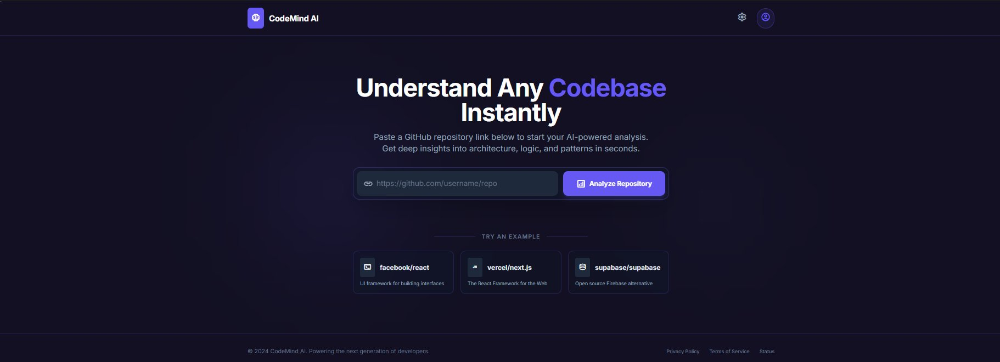
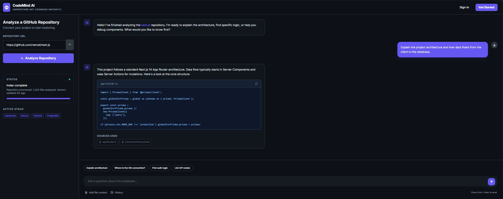

<<<<<<< HEAD
# CodeMind AI — Understand Any Codebase Instantly



> AI-powered codebase explainer. Paste a GitHub repo URL, and ask natural-language questions about any codebase. Powered by **Gemini 2.5 Flash** LLM + **gemini-embedding-001** embeddings + **FAISS** vector search.

---

## Features

- **RAG pipeline** — Clone → chunk code → embed → FAISS index → retrieve → answer
- **Gemini 2.5 Flash** for intelligent code explanations
- **gemini-embedding-001** (768-dim) for semantic search
- **Graceful fallback** — works without an API key (deterministic stub embeddings + placeholder answers)
- **Dark, modern UI** matching the design screenshots in `assets/ui-reference/`
- **Source attribution** — every answer shows the exact file paths and line ranges used

---

## Prerequisites

| Tool | Version |
|------|---------|
| Python | 3.10 or newer |
| Node.js | 18 or newer |
| npm | 9 or newer |
| Git | any recent version |

---

## Quick Start

### Linux / macOS

```bash
# 1. Clone or unzip the repo
cd CodeMindAI

# 2. Configure your API key
cp .env.example .env
# Edit .env and set GEMINI_API_KEY=your_key_here

# 3. Start everything
chmod +x start-dev.sh
./start-dev.sh
```

### Windows

```bat
cd CodeMindAI
copy .env.example .env
REM Edit .env and set GEMINI_API_KEY=your_key_here
start-dev.bat
```

Both commands will:
1. Create a Python venv in `backend/.venv/`
2. Install backend dependencies
3. Install frontend npm packages
4. Start FastAPI on `http://localhost:8000`
5. Start Vite dev server on `http://localhost:5173`

---

## Manual Setup (without start scripts)

### Backend

```bash
cd backend
python3 -m venv .venv
source .venv/bin/activate          # Windows: .venv\Scripts\activate
pip install -r requirements.txt
uvicorn app.main:app --reload --port 8000
```

### Frontend

```bash
cd frontend
npm install
npm run dev
```

---

## Getting a Gemini API Key

1. Go to [Google AI Studio](https://aistudio.google.com/app/apikey)
2. Sign in with your Google account
3. Click **Create API Key**
4. Copy the key into your `.env` file:

```env
GEMINI_API_KEY=AIzaSy...your_key_here...
```

The app works **without a key** — you'll see stub embeddings and placeholder answers, but the full UI flow (cloning, indexing, chat) works end-to-end.

---

## API Reference

### POST `/api/analyze`
Start async repository indexing.

```bash
curl -X POST http://localhost:8000/api/analyze \
  -H "Content-Type: application/json" \
  -d '{"repo_url": "https://github.com/tiangolo/fastapi"}'
```

Response:
```json
{"task_id": "abc123-...", "status": "queued"}
```

### GET `/api/status/{task_id}`
Poll indexing progress.

```bash
curl http://localhost:8000/api/status/abc123-...
```

Response:
```json
{
  "status": "complete",
  "progress": 100,
  "message": "Repository indexed. 42 files · 380 chunks analysed.",
  "file_count": 42,
  "chunk_count": 380,
  "stack_tags": ["Python", "Docker"]
}
```

### POST `/api/chat`
Ask a question about an indexed repository.

```bash
curl -X POST http://localhost:8000/api/chat \
  -H "Content-Type: application/json" \
  -d '{
    "task_id": "abc123-...",
    "question": "How does authentication work in this codebase?"
  }'
```

Response:
```json
{
  "answer": "Authentication is handled in `app/auth.py`...",
  "sources": [
    {
      "file": "app/auth.py",
      "start_line": 1,
      "end_line": 60,
      "snippet": "..."
    }
  ]
}
```

---

## Running Tests

```bash
cd backend
source .venv/bin/activate     # or .venv\Scripts\activate on Windows
python -m pytest tests/test_smoke.py -v
```

---

## Project Structure

```
CodeMindAI/
├── .env.example              # Environment variable template
├── .gitignore
├── start-dev.sh              # Linux/macOS one-command startup
├── start-dev.bat             # Windows one-command startup
├── README.md
├── VERIFICATION.md           # Build & test verification log
├── assets/
│   └── ui-reference/         # Design reference screenshots
├── backend/
│   ├── requirements.txt
│   ├── app/
│   │   ├── main.py           # FastAPI app + CORS
│   │   ├── api/
│   │   │   └── routes.py     # /analyze, /status, /chat endpoints
│   │   ├── core/
│   │   │   ├── embeddings.py # Gemini gemini-embedding-001 + stub fallback
│   │   │   ├── gemini_client.py # Gemini 2.5 Flash LLM
│   │   │   └── vectorstore.py # FAISS index create/search
│   │   └── services/
│   │       └── rag_engine.py # Clone → chunk → embed → index → answer
│   └── tests/
│       └── test_smoke.py
└── frontend/
    ├── package.json
    ├── vite.config.js
    ├── tailwind.config.js
    ├── index.html
    └── src/
        ├── App.jsx
        ├── index.css
        ├── lib/api.js         # Axios client
        ├── pages/
        │   ├── LandingPage.jsx
        │   └── ChatPage.jsx
        └── components/
            ├── MarkdownMessage.jsx
            └── SourcesPanel.jsx
```

---

## UI Design Reference

The UI is based on two design screenshots:

| Screenshot | Description |
|-----------|-------------|
|  | Landing page — hero, URL input, example repos |
|  | Chat page — left status panel, right chat area with source cards |

---

## Troubleshooting

| Problem | Solution |
|---------|----------|
| `Connection refused` on frontend | Make sure backend is running: `cd backend && uvicorn app.main:app --reload` |
| `GEMINI_API_KEY` errors | Copy `.env.example` to `.env` and set the key. App works in stub mode without it. |
| Clone fails for large repos | The `depth=1` shallow clone is used to speed things up. Private repos require SSH setup. |
| FAISS not installed | Run `pip install faiss-cpu` in your backend venv. |
| Port already in use | Change `BACKEND_PORT` in `.env` and update the Vite proxy in `frontend/vite.config.js` |

---

## Tech Stack

| Layer | Technology |
|-------|-----------|
| Frontend | React 18 + Vite + Tailwind CSS |
| Backend | Python 3.10+ + FastAPI + Uvicorn |
| Embeddings | Google `gemini-embedding-001` (768-dim) |
| LLM | Google `gemini-2.5-flash` |
| Vector DB | FAISS (faiss-cpu, local) |
| Repo cloning | GitPython |
| HTTP client | Axios |

---

*© 2024 CodeMind AI. Powering the next generation of developers.*
=======
# CodeMind-Ai
CodeMind AI is an AI-powered codebase explainer that lets developers paste a GitHub repository and ask questions about the project. It uses Retrieval-Augmented Generation (RAG), Gemini LLM, and FAISS vector search to analyze code and generate contextual explanations.
>>>>>>> 07a3ef1a7b2ad8ecac30e678eda9b1371d2596b8
